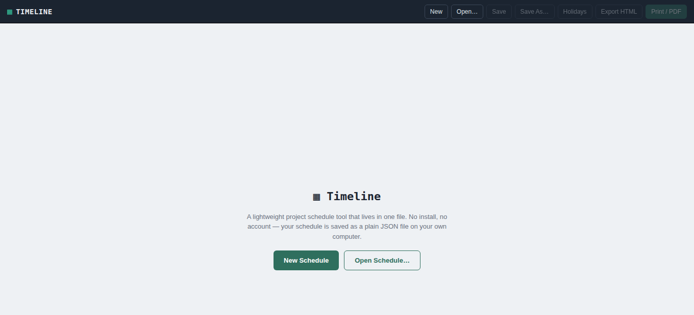
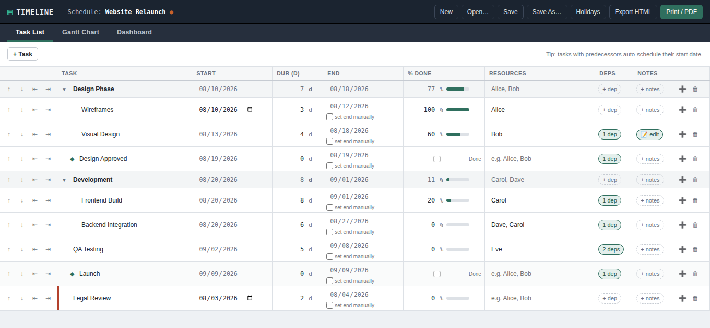
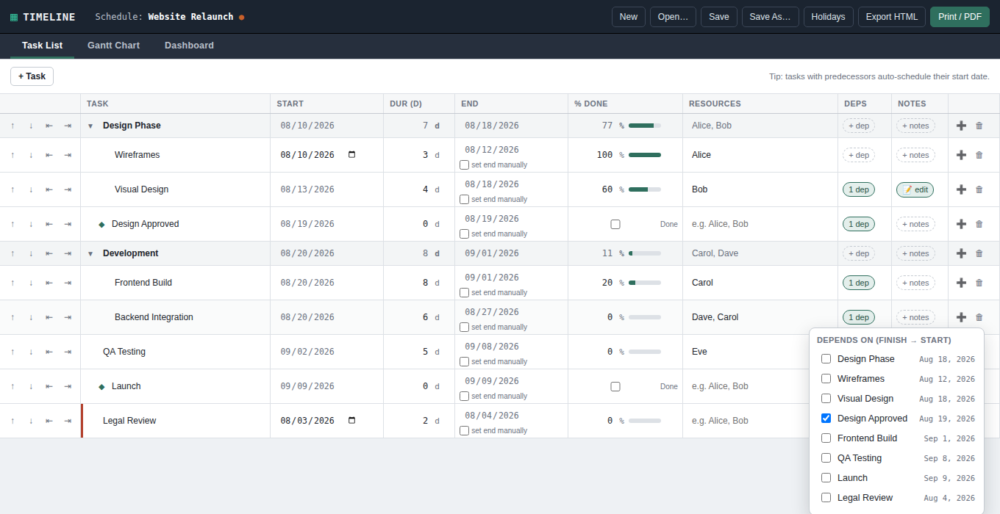
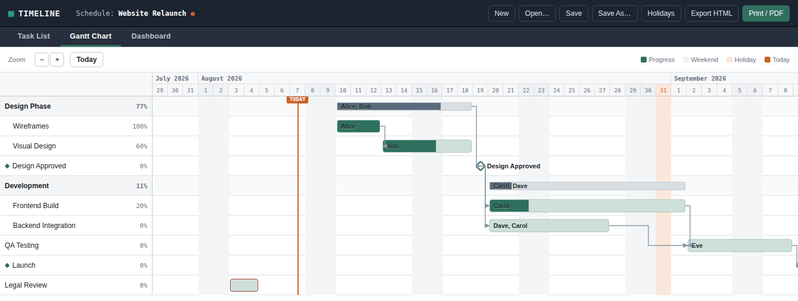
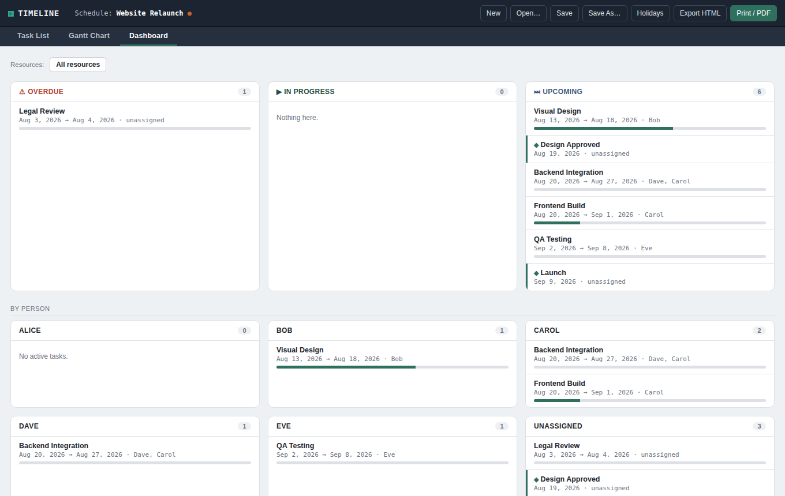
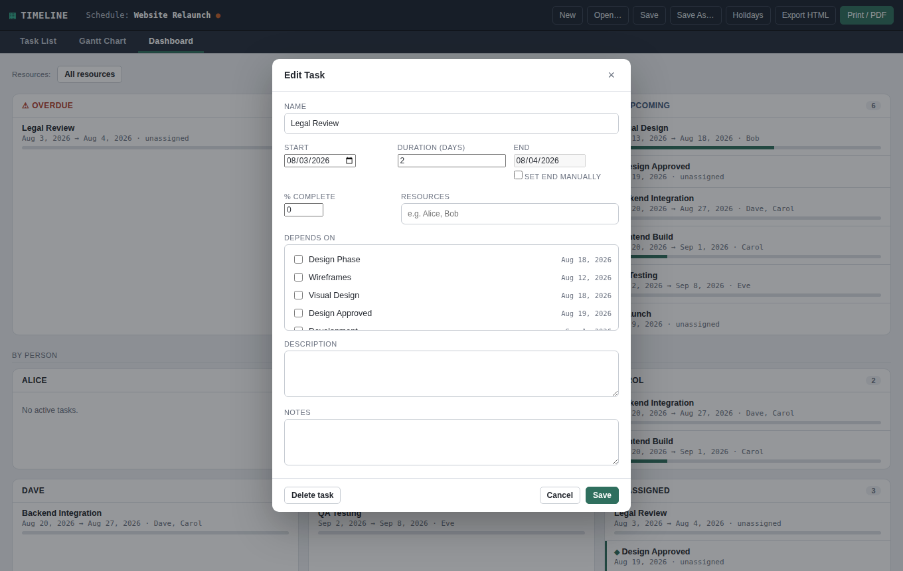

# Timeline: a single-file project schedule tool

Timeline is a lightweight Gantt-chart / project scheduler that runs entirely as one self-contained
HTML file. There's nothing to install, no server, no account, and no dependency on any external
service. Open the file in a browser and it works. Your schedule is saved as a plain `.json` file on
your own computer, which you own and can back up, version-control, or move between machines however
you like.

## Why this exists

Most project-scheduling tools are either heavyweight SaaS products with logins and subscriptions, or
spreadsheets that don't understand dependencies or working days. Timeline sits in between: it has the
core features you actually need for a small-to-medium project: a Gantt chart, task dependencies,
working-day-aware scheduling, resource tracking, and a status dashboard, with zero setup.

## Getting started

1. Download `timeline-schedule-tool.html` and open it in a modern desktop browser (Chrome, Edge, or
   Firefox all work; see the [browser support](#browser-support) note below for how saving differs
   between them).
2. Click **New Schedule** and give it a name.
3. Start adding tasks.

That's it. There's no install step, and nothing is sent anywhere over the network.

## The three views

Timeline has three tabs, each suited to a different kind of work.

### Task List

The Task List is where you build out and edit the plan in detail: add tasks and subtasks, set
durations, wire up dependencies, assign resources, and track progress. Every field is editable
inline.

- **Add a task** with the **+ Task** button, or **+** on an existing row to add a subtask underneath it.
- **Reorder or nest tasks** with the arrow buttons in the first column: indent a task to make it a
  subtask of the row above it, or outdent to pull it back up a level.
- **Set a duration**, and the end date is calculated automatically, skipping weekends and any holidays
  you've defined (see [Non-working days](#non-working-days-holidays) below). Tick **set end manually**
  on a task if you'd rather pin an end date directly and let the tool work out the duration instead.
- **Dependencies**: click the **+ dep** chip to pick which task(s) a task depends on. Once set, its
  start date is calculated automatically as the working day after its last dependency finishes, and
  the field greys out, and you manage the schedule through dependencies rather than by hand-editing
  locked dates.

  

- **A task with subtasks** becomes a summary row: its own start, end, duration, % complete, and
  resources are automatically rolled up from its children and shown read-only.
- **Resources**: type one or more names, comma-separated. Names are matched case-insensitively, so
  typing "joe" when "Joe" already exists elsewhere just lines up with the existing spelling, so you
  won't end up with duplicate people.
- **Notes**: click **+ notes** to add a longer description or notes to a task, shown in a small popup
  editor.
- Hover over any Deps, Resources, or Notes chip to preview its contents without opening anything.

### Gantt Chart

A visual timeline of the whole schedule: bars sized by duration, colored by progress, connected by
dependency arrows, with weekends and holidays shaded and a marker for today.

- **Zoom** in or out with the buttons in the toolbar, or jump back to **Today**.
- **Milestones** (see below) show as a diamond instead of a bar.
- **Hover** over a bar, or the small ⓘ icon that appears next to a task's name on hover, to see its
  full details without leaving the chart.
- **Double-click** a bar or a task's name to open the full edit form, handy for making changes during
  a review without switching tabs.

### Dashboard

A status-oriented view for check-ins and stand-ups: what's overdue, what's in progress, what's coming
up, and what each person currently has on their plate.

- Filter to one or more people using the **Resources** button, or pick nobody to see everyone.
- Tasks with no one assigned show up under a virtual **Unassigned** card at the bottom, so nothing
  slips through unnoticed (this only appears when no filter is applied).
- **Double-click any task card** to edit it right there, in a form-style dialog rather than jumping
  back to the row-based Task List. This is ideal for updating status live during a team review.

  

## Key concepts

### Working days & non-working days

All scheduling is done in working days. Weekends are always excluded automatically. Click **Holidays**
in the top bar to add specific dates (public holidays, office closures, etc.) that should also be
skipped, and durations and dependency chains route around them automatically.

### Dependencies

Dependencies are finish-to-start: a task can't start until every task it depends on has finished
(plus the next working day). A task's own start date locks once it has a dependency, so you drive the
schedule by rearranging dependencies instead of fighting with a date field.

### Milestones

Set a task's **Duration to 0** and it automatically becomes a milestone; no separate checkbox needed.
Milestones show as a diamond marker instead of a bar on the Gantt chart, get a ◆ next to their name
everywhere else, and use a simple **Complete** checkbox instead of a percentage (since a single point
in time is either done or it isn't). Milestones can't have resources assigned, since nobody is
"working on" a single point in time.

### Parent tasks (summary rows)

Give a task subtasks and it automatically becomes a summary row: its dates, % complete, and resources
are calculated from its children and can't be edited directly. This keeps the rollup always accurate;
edit the subtasks, and the parent updates itself.

## Saving, opening, and sharing your schedule

- **Save** / **Save As** write your schedule to a `.json` file. On a browser with the File System
  Access API (Chrome, Edge), Save writes straight back to the file you already picked, and Save As
  lets you choose a new location. On browsers without it (Firefox, Safari), Save re-downloads using
  the same filename each time, and Save As always asks you to confirm or change it.
- **Open** loads any `.json` file this tool has previously saved.
- **Export HTML** produces a separate, read-only, self-contained snapshot of your schedule (Gantt
  chart, task list, and status summary), good for sharing with someone who doesn't need to edit it,
  with nothing editable and no data embedded that would let them modify the original.
- **Print / PDF** prints whichever tab you're on. Printing the Gantt chart opens a small separate
  print window sized specifically for the page, rather than printing the on-screen scrolling view
  as-is.

## Browser support

Timeline works in any modern desktop browser. The one meaningful difference is how **Save** behaves:

| Browser | Save behavior |
|---|---|
| Chrome, Edge (Chromium-based) | Uses the File System Access API - Save writes directly back to your chosen file, no dialog after the first time. |
| Firefox, Safari | Falls back to downloading a file each time you save (standard browser download, not a special integration). |

Either way, your data never leaves your computer.

## Data format

Schedules are saved as plain JSON: human-readable, diffable, and easy to script against if you ever
want to. See [ARCHITECTURE.md](ARCHITECTURE.md) for the full data model if you're building something
on top of it.

## Limitations

- Single-user: there's no real-time collaboration or multi-user editing.
- No undo/redo (the confirm-before-discard prompts in the edit dialog are the main safety net; save
  often).
- Printing a very long schedule across multiple pages doesn't repeat the date header on each page.
- The exported static HTML is a snapshot at the time of export; it isn't a live sync back to the
  original schedule.

## License

Add whatever license you'd like this repository to use.
